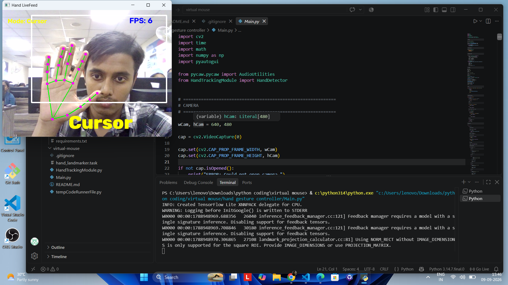

# 🖱️ Virtual Mouse

A gesture-based virtual mouse built with **Python, OpenCV, MediaPipe, and PyAutoGUI**.

The project uses a webcam and real-time hand tracking to allow users to control the computer mouse using hand gestures.


---

## 📸 Demo

The Virtual Mouse uses real-time hand tracking to control the computer through gestures.



---

## ✨ Features

| Feature | Description |
|---|---|
| 🖱️ Virtual Cursor | Control the mouse cursor using hand movements |
| 👆 Left Click | Perform a left click using a hand gesture |
| 🤚 Right Click | Perform a right click using a hand gesture |
| ↕️ Scrolling | Scroll through pages using hand gestures |
| 🔊 Volume Control | Adjust Windows system volume using hand gestures |
| ✋ Hand Tracking | Detect and track 21 hand landmarks in real time |
| 📷 Webcam Control | Uses a webcam for real-time gesture recognition |
| 📊 FPS Display | Displays the current processing frame rate |
| 🎯 Gesture Modes | Switch between cursor, scrolling, and volume control |

---

## 🖐️ Gesture Controls

| Hand Gesture | Action |
|---|---|
| ☝️ Index + Middle + Ring + Pinky | Cursor mode |
| ✌️ Index + Middle | Scroll mode |
| 👍☝️ Thumb + Index | Volume control |
| 👍 Thumb gesture | Left click |
| 🤙 Pinky gesture | Right click |
| ✊ Hand closed | Exit cursor control mode |
| ⌨️ Press `Q` | Exit the application |

> Gesture recognition is performed using hand landmarks detected by MediaPipe.

---

## 🛠️ Technology Stack

### Programming Language

- Python

### Computer Vision

- OpenCV
- MediaPipe

### Automation

- PyAutoGUI
- Pycaw

### Supporting Libraries

- NumPy
- Comtypes

---

## 📌 Project Status

**Working Project — Active Development**

The current version supports:

- Real-time hand tracking
- Virtual cursor movement
- Left-click interaction
- Right-click interaction
- Scrolling
- Windows volume control
- FPS monitoring
- Webcam-based interaction

Future improvements will focus on improving gesture accuracy, smoother cursor movement, additional gestures, and broader platform support.

---

## 📂 Project Structure

```text
virtual-mouse/
│
├── Main.py
├── HandTrackingModule.py
├── hand_landmarker.task
├── requirements.txt
├── README.md
├── .gitignore
│
└── screenshots/
    └── virtual-mouse-demo.png

## 📜 License

This project is licensed under the **MIT License**.

See the [LICENSE](LICENSE) file for details.